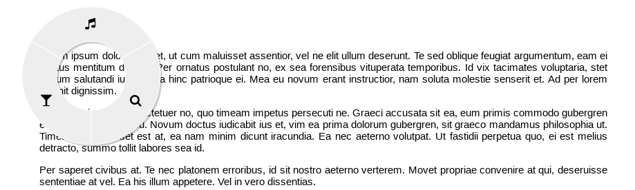

# Radial Menu

A highly customizable [radial menu](https://en.wikipedia.org/wiki/Pie_menu) that's very easy to setup.

## About

A radial menu, also known as pie menu, is a circular context menu where selection depends on direction. It is a graphical control element. [[wikipedia]](https://en.wikipedia.org/wiki/Pie_menu)

Create a customized and beautiful radial menu for your web app that can be used as a standalone menu or override the default context menu. On a desktop or notebook click the second button of the mouse (context menu). On a smartphone or tablet, click the screen and hold for few seconds and the menu will pop.

*Work in progress. Writing the documentation and doing some tests.*

